# ElizaOS LiveKit Plugin

Enable your AI agents to have natural voice conversations with users through LiveKit's real-time communication infrastructure.

## What It Does

The LiveKit plugin transforms your ElizaOS agents into voice-enabled assistants that can:
- 🎙️ **Listen and respond** in real-time voice conversations
- 🗣️ **Speak naturally** with text-to-speech synthesis
- 👥 **Join voice rooms** where multiple participants can interact
- 📝 **Remember conversations** with automatic transcription and memory storage
- 🌐 **Work anywhere** via web browser with no downloads required

## Quick Start

### 1. Install the Plugin

```bash
bun add @elizaos/plugin-livekit
```

### 2. Set Your Credentials

```bash
# In your .env file
LIVEKIT_URL=wss://your-livekit-server.com
LIVEKIT_API_KEY=your-api-key
LIVEKIT_API_SECRET=your-api-secret
```

### 3. Add to Your Agent

```typescript
import { liveKitPlugin } from '@elizaos/plugin-livekit';

const runtime = await createAgentRuntime({
  plugins: [liveKitPlugin],
  // ... your other config
});
```

### 4. Start Talking!

Open your browser to `http://localhost:3000/livekit/display` and start a voice conversation with your agent.

## How It Works


Your agent automatically:
1. **Detects when you're speaking** using smart voice activity detection
2. **Transcribes your words** into text for processing
3. **Generates a response** based on its personality and knowledge
4. **Speaks the response** back to you in a natural voice

## Key Features

### 🎯 Natural Conversations
The plugin handles all the complexity of voice communication:
- Knows when you start and stop speaking
- Waits for you to finish before responding
- Maintains conversation context across turns

### 💾 Conversation Memory
Every voice interaction is automatically saved:
- Full transcripts of what was said
- Who said what and when
- Available for the agent to reference later

### 🖥️ Built-in Voice Interface
Includes a ready-to-use web interface with:
- One-click room joining
- Visual indicators for who's speaking
- Real-time conversation transcripts
- Download conversation history

### 🔧 Flexible Configuration
Customize the experience with optional settings:
- Adjust voice detection sensitivity
- Set speech duration limits
- Configure audio quality
- Choose your TTS provider

## Architecture Overview

```mermaid
graph TB
    subgraph "Users"
        U1[👤 User 1]
        U2[👤 User 2]
        U3[👤 User 3]
    end
    
    subgraph "LiveKit Infrastructure"
        ROOM[🎙️ Voice Room<br/><i>WebRTC Audio Streams</i>]
    end
    
    subgraph "Your AI Agent"
        subgraph "ElizaOS + LiveKit Plugin"
            VAD[🎯 Voice Detection<br/><i>Detects speech start/end</i>]
            STT[📝 Transcription<br/><i>Speech → Text</i>]
            BRAIN[🧠 AI Processing<br/><i>Understands & Responds</i>]
            TTS[🔊 Voice Synthesis<br/><i>Text → Speech</i>]
        end
    end
    
    U1 -.->|Audio| ROOM
    U2 -.->|Audio| ROOM
    U3 -.->|Audio| ROOM
    
    ROOM -->|Incoming Audio| VAD
    VAD -->|Complete Speech| STT
    STT -->|User Message| BRAIN
    BRAIN -->|Agent Response| TTS
    TTS -->|Outgoing Audio| ROOM
    
    style ROOM fill:#FF6B6B,stroke:#C92A2A,color:#fff
    style VAD fill:#A8E6CF,stroke:#52B788,color:#333
    style STT fill:#FFD3B6,stroke:#FF8A65,color:#333
    style BRAIN fill:#C7CEEA,stroke:#9FA8DA,color:#333
    style TTS fill:#FFAAA5,stroke:#FF8A80,color:#333
    style U1 fill:#FFE066,stroke:#F59F00,color:#333
    style U2 fill:#FFE066,stroke:#F59F00,color:#333
    style U3 fill:#FFE066,stroke:#F59F00,color:#333
```



## Available Commands

Your agent understands natural language commands for voice interaction:

- **"Join the voice chat"** - Agent enters the voice room
- **"Leave the call"** - Agent exits the voice room  
- **"Mute yourself"** - Agent stops transmitting audio
- **"Can you hear me?"** - Agent confirms audio connection

## API Reference

### For Developers

#### Generate Room Access
```http
POST /livekit/token
{
  "roomName": "meeting-room",
  "participantName": "John"
}
```

#### Agent Room Control
```http
POST /livekit/join-agent
{
  "roomName": "meeting-room"
}
```

#### Voice Chat Interface
```http
GET /livekit/display
```

## Troubleshooting

### Can't hear the agent?
- Check your browser allows microphone access
- Ensure your LiveKit server is running
- Verify your API credentials are correct

### Agent not understanding you?
- Speak clearly and avoid background noise
- Check the voice detection settings
- Ensure you have OpenAI API access for transcription

### Connection issues?
- Verify your LiveKit URL is correct
- Check firewall settings for WebRTC
- Try using a different browser

## Requirements

- **LiveKit Server** (cloud or self-hosted)
- **OpenAI API** key for transcription
- **Modern web browser** with microphone access
- **Bun** runtime for running the agent

## Get Started

1. [Sign up for LiveKit Cloud](https://livekit.io) or deploy your own server
2. Install the plugin and configure your credentials
3. Start your agent and open the voice interface
4. Begin having natural voice conversations!

## Support

- 📚 [LiveKit Documentation](https://docs.livekit.io)
- 💬 [ElizaOS Discord](https://discord.gg/elizaos)
- 🐛 [Report Issues](https://github.com/elizaos/eliza/issues)

## License

MIT